<h1 align="center">KaizoCore</h1>

<b>Kaizo IronMON on your phone.</b> 
Emulator, randomizer, patcher and the IronMON tracker in one Android app.

  
  
  
  

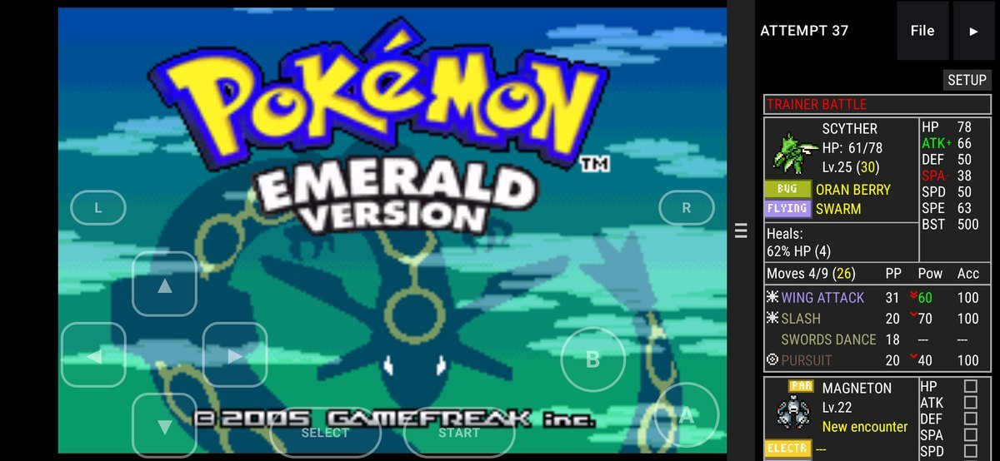

Playing IronMON today takes a PC, a patcher, a randomizer, an emulator, a tracker that only runs on a computer, and OBS. KaizoCore does all of that on an Android phone. Add your game, pick a mode, tap **Start**, and the tracker is under the game when you get your starter.

  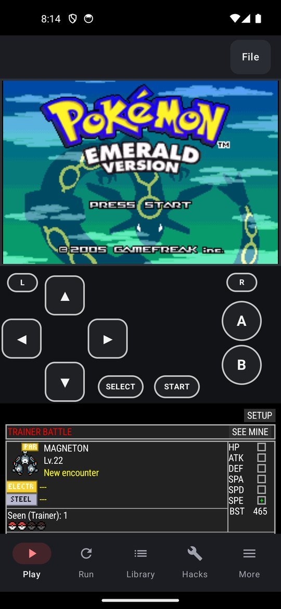
  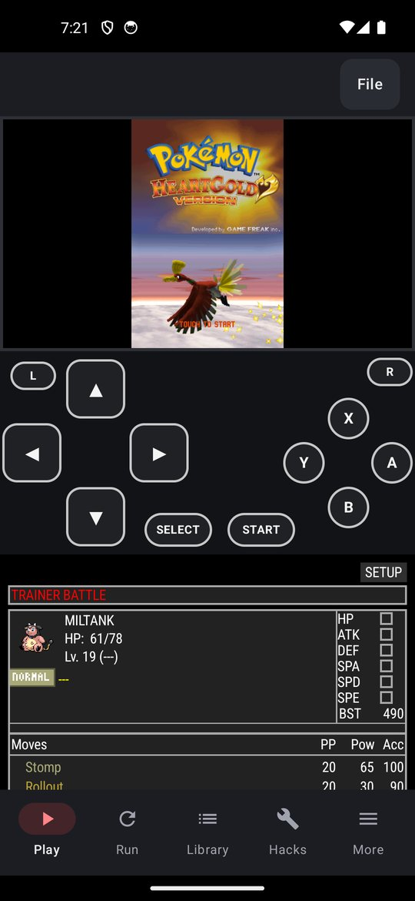
  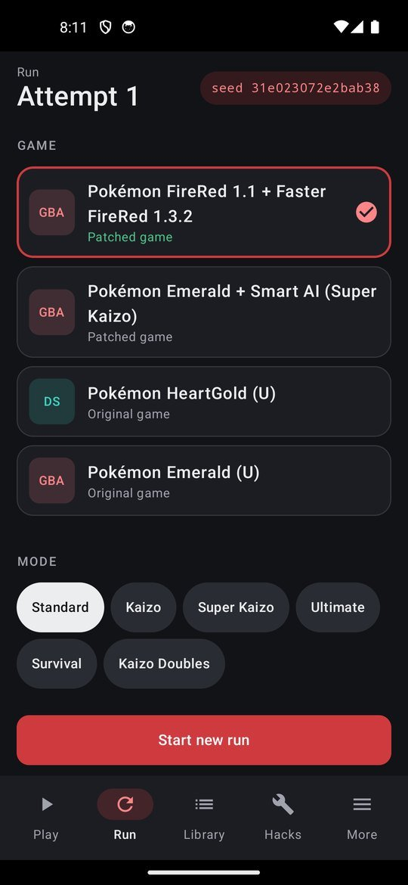
  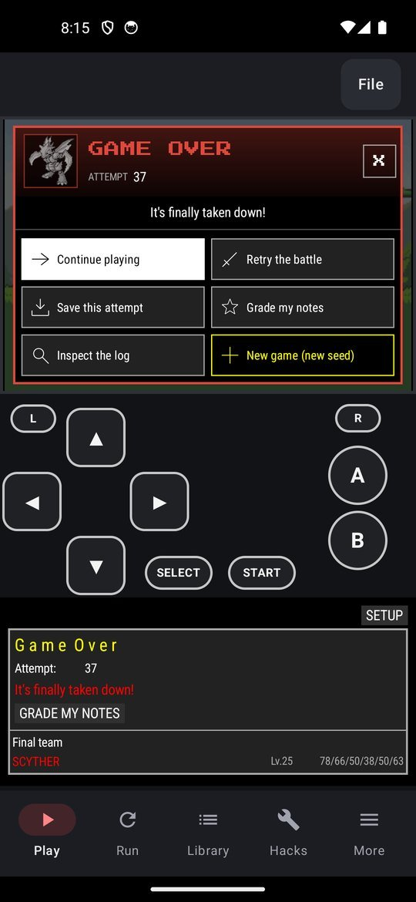

## What it does

**Tracks the run.** The app has its own copy of the PC IronMON tracker, reading the game while you play: your party, the opponent, moves seen, stat notes, abilities as they are revealed, badges, heals, evolutions and friendship. Tap an ability or a move to read what it does. It covers Gen 1 through Gen 5. The sprites come from your own ROM on Gen 3 and most DS games, and from the trackers' own art on Game Boy games and Nat. Dex builds. When a run ends you get the PC tracker's game over popup: continue, retry the battle, save the attempt, grade your notes, inspect the log, or roll a new seed.

**Randomizes on the phone.** Universal Pokémon Randomizer ZX is built into the app, not a second download. Pick Standard, Ultimate, Kaizo, Super Kaizo, Survival or Kaizo Doubles from the official settings files, the community's Survival Revival, IronMON Journey, Chaos Kaizo and Evo Kaizo, or the Nat. Dex set, or change any setting in the editor. The steps the rules add, Gen 1's second pass and the 60% levels for Emerald, Gold, Silver and Crystal, are done for you and yours to switch off, and the log opens full screen on the phone.

**Nuzlockes.** Pick a preset or change any of its 19 rules. The tracker notices first encounters, catches, faints and whiteouts and keeps the ledger, with level caps at the bosses, on every game it reads.

**Builds your own.** Any starter from the game's dex and plain-words randomizer choices, saved as your own settings file and labeled custom everywhere.

**Patches and hacks.** The library says what each dump is and whether it is clean. BPS and UPS patches name their game and are refused on any other, so a wrong one never makes a broken ROM; for IPS and xdelta you say which game each is for. ROM Hacks on the Home screen lists the hacks made for your game and opens each creator's own page. Nat. Dex for Emerald and FireRed v1.1 is built in, and so is MaxDex Kaizo IronMON for FireRed v1.1, with Trip's own patch.

**Plays everything IronMON runs on.** Game Boy, Game Boy Color, GBA and DS, with eight save slots with screenshots, an auto-save, rewind, fast forward, slow motion, controllers, custom button layouts and skins. In landscape the tracker docks beside the game; on DS both screens and the tracker fit without overlapping.

**Streams.** Turn on STREAM and open the address it shows on your PC. The game's picture and sound go to OBS over a USB cable (one adb line on the PC) or your own Wi-Fi, with no screen mirroring and no capture card: download the OBS scene from that page, import it, and OBS has the game, the tracker and the attempt counter laid out at 1920 x 1080. It works for any game you play, run or not. Where a game has no tracker the tracker box says so in one line, and the attempt counter stays empty outside a run. Clean View still hides everything but the game if you would rather capture the screen. Cheats and rewind switch themselves off on a tracked run.

**Makes it yours.** Play as your Pokémon on Game Boy Advance games: your lead walks the map in your place, with sprites for 980 of the 1,025 Pokémon and 164 forms, or play as a picture or sprite sheet of your own. Every tracker animates the same Pokémon. Tracker themes: the PC tracker's 15 presets, the DS tracker's 15 and a Default, your own, and a photo of your own behind the tracker.

**Keeps your progress.** RetroAchievements, with a hardcore mode that locks the helpers. Saves sync to the cloud through Android's file picker. A backup leaves your library games out; it carries the current run's randomized game, so a restored run comes back whole, and the game of every attempt you saved (a DS game is up to 512 MB). With cloud sync on, that backup is what goes to your cloud.

  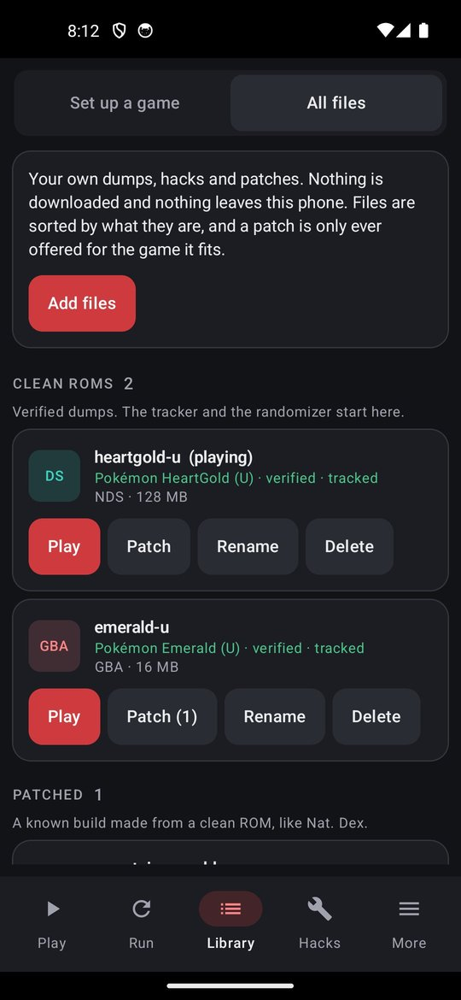
  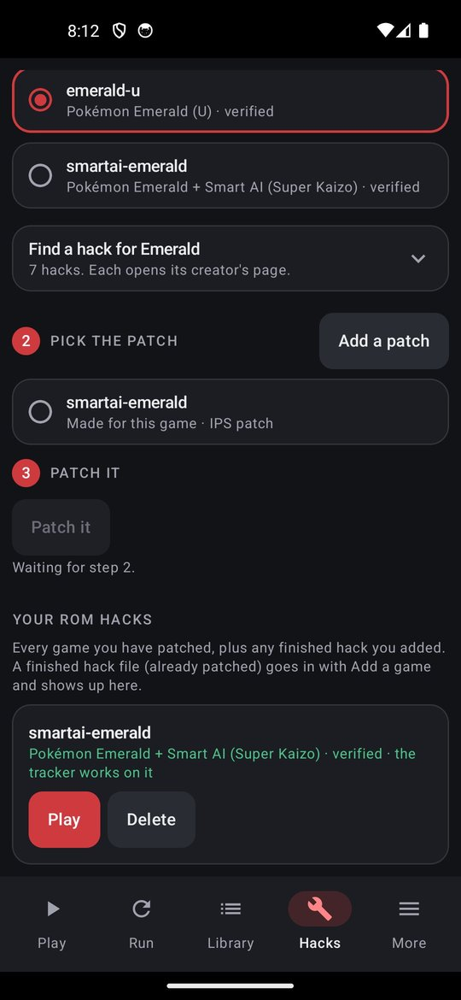
  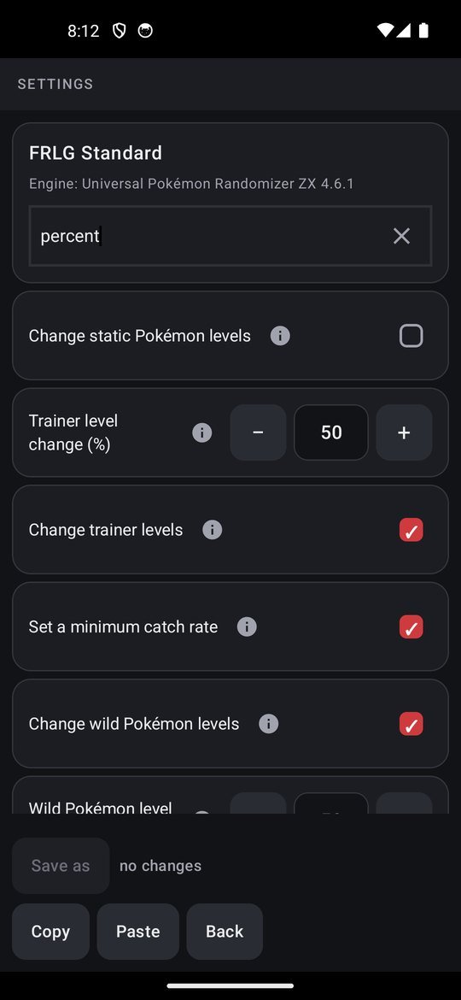
  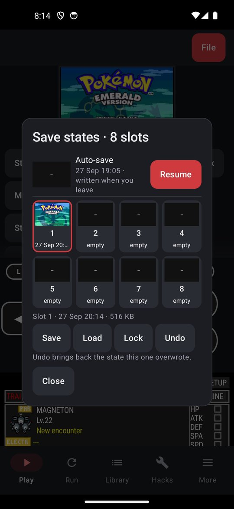

## Every game the tracker knows

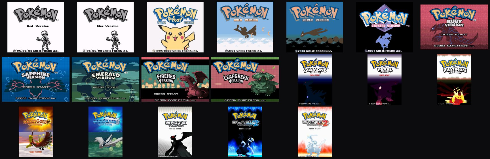

Red, Blue and Yellow; Gold, Silver and Crystal; Ruby, Sapphire, Emerald, FireRed and LeafGreen; Diamond, Pearl, Platinum, HeartGold and SoulSilver; White, Black 2 and White 2, the US releases. Black plays, and its tracker waits on one check against a real dump. Each title above is a player's own dump, booted in the app.

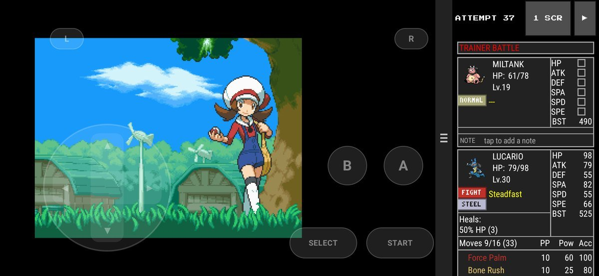

## Get it

1. Download the APK from the [latest release](https://github.com/blakeportable7-del/KaizoCore/releases/latest) or from [willowcreek.group/kaizocore](https://willowcreek.group/kaizocore). Both list the SHA-256.
2. Open it on the phone. Android asks once to let your browser or file manager install apps.
3. **Library**, **My games**, **Add files**, pick your dump (a zip is fine).
4. **Home**, **Kaizo IronMON**, pick the game and a mode, **Start attempt 1**. Then play.

To update, install the new APK over the old one. Uninstalling deletes your games, saves, notes and attempt count.

**You need your own game dumps.** KaizoCore contains no ROMs and downloads none, and this repository never will. A 64-bit phone with Android 8 or newer (a 32-bit phone cannot install it); a DS game wants at least 3 GB of RAM.

Found a bug? In the app go to **More**, **Backup and info**, **Report a bug**, or [open an issue](https://github.com/blakeportable7-del/KaizoCore/issues). Never attach a ROM or a save.

## Credits

Built on [LibretroDroid](https://github.com/Swordfish90/LibretroDroid) with the mGBA, melonDS and Gambatte cores; [Universal Pokémon Randomizer ZX](https://github.com/Ajarmar/universal-pokemon-randomizer-zx) and the Nat. Dex fork; rcheevos for [RetroAchievements](https://retroachievements.org). The tracker follows the [Ironmon-Tracker](https://github.com/besteon/Ironmon-Tracker) by Besteon, its Gen 1 and Gen 2 forks by Sannji ([Ironmon-gen-tracker](https://github.com/mollo010/Ironmon-gen-tracker)) and seadogstingray ([Ironmon-gen-2-tracker](https://github.com/seadogstingray/Ironmon-gen-2-tracker)), and the [NDS-Ironmon-Tracker](https://github.com/Brian0255/NDS-Ironmon-Tracker) by Brian0255. [Nat. Dex Extension](https://github.com/CyanSMP64/NatDexExtension) by CyanSixFour (CyanSMP64), used with permission. [Faster FireRed](https://github.com/DrMaple/Faster-FireRed) and [Faster Emerald](https://github.com/DrMaple/Faster-Emerald) by DrMaple, [Faster Black 2 / White 2](https://github.com/SilverstarStream/faster_black2_white2) by SilverstarStream, and [IronMON HGSS](https://github.com/PyroMikeGit/IronMONHGSS) by PyroMikeGit, built on SilverstarStream and Foulton's intro skip patch. [MaxDex Kaizo IronMON](https://github.com/Tripc423/Maxdex) by Trip (Tripc423), with moves and abilities from rh-hideout's [pokeemerald-expansion](https://github.com/rh-hideout/pokeemerald-expansion). The IronMON rulesets are iateyourpie's and the community's; [NOTICE](NOTICE) lists every ruleset, settings file and patch the app bundles, with its author and source. Press Start 2P by CodeMan38, under the SIL Open Font License.

KaizoCore is free software under the [GPL-3.0](LICENSE). It is not affiliated with Nintendo, Game Freak, The Pokémon Company, IronMON or RetroAchievements. Screenshots show the player's own copy of each game running in the app.

A side project from [Willow Creek Group](https://willowcreek.group), St. Clairsville, Ohio. KaizoCore is free, with nothing to buy.

Build notes and the development log are in [docs/DEVELOPMENT.md](docs/DEVELOPMENT.md).
